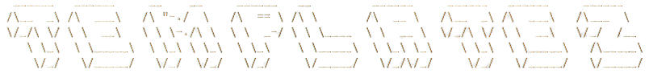

<h1 align="center">
  
  <h5 align="center"> A template manager written in Python </h5>
</h1><br>

## Installation

**Using installation script**

- Download installation script from the [release](https://github.com/Besufikad17/Templatez/releases/download/%23script/install.sh) page.
```bash
   sudo chmod u+x ./install.sh && ./install.sh
```

**Building from source**

- clone the repo
```bash
   git clone https://github.com/Besufikad17/Templatez.git 
```
- navigate to templatez directory
```bash 
   cd Templatez
```
- install packages
```bash
   pip3 install -r requirements.txt
```
- set templatez.py excutable
```bash 
   sudo chmod +x templatez.py   
```
- running the script
```bash
   python3 templatez.py
```

## Usage

Templatez can be used with command line arguments or through the builtin TUI.

- Using templatez with command line arguments

   ```bash
      templatez.py [command] [flags]
   ```
   To get information about the avaliable commands and flags in templatez users can use the `help` command. 

   ```bash
      templatez.py help
   ```

- Using the TUI

   <u>Getting templates using flags</u>

   Templatez allow users to browse templates and boilerplates by giving different filters as flags using full text search feature.

   ```bash
      -> templates [flag=value]
   ``` 
   **Flags** <br>
   ```
      name   -----  name of the template 
      type   -----  type of the template 
      author -----  author of the template 
      language ---- programming language used 
   ```

   <u>Using specific template</u>

   Users can download and use templates in specific directory using `use` command which require the name of the template then the project title.

   ```bash
      -> use name=name_of_the_template
   ``` 
  
   <u>Adding new templates</u>

   Users can add custom templates using `add` command and by providing basic information (name, github url, tech stack and type) of the template.

   ```bash
      -> add
   ``` 

## Contributing

- Create an issue or pick one of the issues
- Clone the repo and start working on the issue
- Create a pull request 

For additional questions and suggestions you can reach me in my socials.
   


